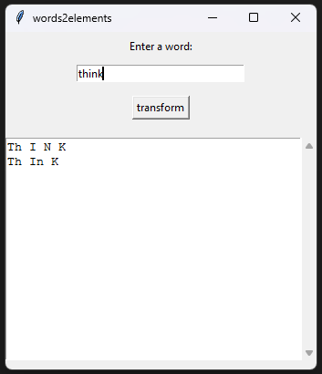

# words2elements

## Description

words2elements transforms an input word into all possible sequences of chemical element symbols whose concatenation spells that word.

For example, the word `think` can be represented as `Th I N K` (thorium, iodine, nitrogen, potassium) or `Th In K` (thorium, indium, potassium) if such a decomposition exists using real periodic table symbols.

The project provides:
- A small core solver (`tool.py`) that computes all valid decompositions.
- A minimal command-line interface (`cli.py`).
- A simple Tkinter-based GUI (`gui.py`) to experiment interactively.

## Installation

1. **Clone the repository**
   ```bash
   git clone https://github.com/<your-username>/words2elements.git
   cd words2elements
   ```

2. **(Optional) Create and activate a virtual environment**
   ```bash
   python -m venv .venv
   .venv\Scripts\activate  # Windows
   # source .venv/bin/activate  # Linux/macOS
   ```

3. **Install dependencies**
   If you have a `requirements.txt` file:
   ```bash
   pip install -r requirements.txt
   ```

   Otherwise, install Tkinter if needed (on some platforms it is included with Python by default).

## Usage

### Command-line interface

The CLI reads a single word from standard input and prints all valid decompositions as lists of element symbols.

```bash
python cli.py
word2elements
```

Example (interactive):

```bash
$ python cli.py
coffee
[['Co', 'F', 'Fe']]
```

If no decomposition is possible, the result is an empty list: `[]`.

### GUI



To start the Tkinter GUI:

```bash
python gui.py
```

- Enter a word in the input field.
- Click the **transform** button.
- All valid decompositions are shown, one per line, with element symbols separated by spaces (e.g. `Co F Fe`).

If no combinations are found, the GUI shows "No combinations found.".

## Requirements

- Python 3.x (tested with your local version)
- Standard library only for core logic (`tool.py` and `cli.py`)
- Tkinter for the GUI (`gui.py`)

Optionally, you can add a `requirements.txt` if you introduce external dependencies in the future.

## Project Structure

```text
words2elements/
├─ tool.py   # Core solver: finds all element-symbol decompositions of a word
├─ cli.py    # Minimal CLI: reads a word from stdin, prints decompositions
├─ gui.py    # Tkinter GUI: interactive interface for entering words and viewing results
├─ README.md # Project documentation
├─ LICENSE   # Project license (if present)
└─ image.png # example of GUI 
```